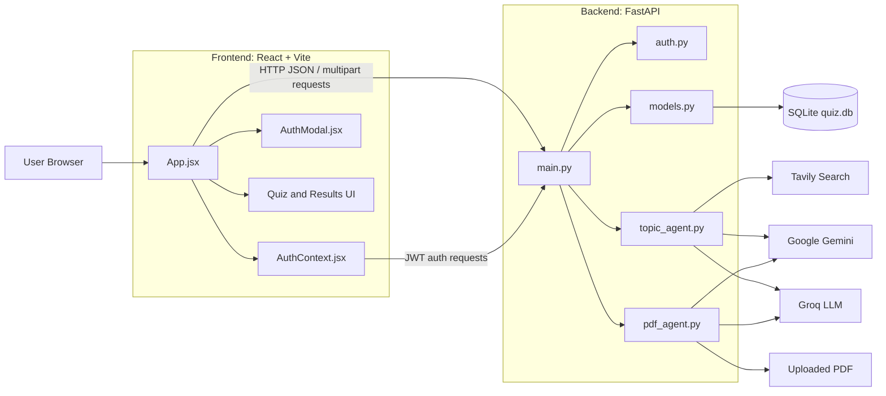

# QuizCraft AI

QuizCraft AI is an intelligent quiz-generation platform that creates personalized multiple-choice quizzes from user-provided topics or uploaded PDF documents.

Users can choose the difficulty level, question count, and timer settings, then answer interactive questions and receive immediate scores, correct answers, and explanations.

## Features

- Generate quizzes from any topic
- Generate quizzes from selectable-text PDF documents
- Optional live web context through Tavily Search
- Gemini AI generation with Groq fallback
- Difficulty levels: Mixed, Easy, Medium, and Hard
- Question-count options: 5, 10, or 15
- Per-question timer with an option to turn it off
- Interactive multiple-choice quiz interface
- Immediate score calculation and answer explanations
- User signup, login, logout, and session restoration
- JWT-based authentication
- Bcrypt password hashing
- PDF type and file-size validation
- Responsive React frontend
- FastAPI backend with SQLite persistence for users

## Architecture



## Technology Stack

### Frontend

- React 19
- Vite
- JavaScript and JSX
- CSS
- Browser Fetch API
- Browser local storage for JWT persistence

### Backend

- Python
- FastAPI
- Uvicorn
- SQLModel
- SQLite
- Pydantic
- Python-JOSE for JWT tokens
- Passlib and bcrypt for password hashing
- PyPDF for PDF text extraction
- LangChain integrations for AI providers and search

### External Services

- Google Gemini for primary quiz generation
- Groq for AI fallback generation
- Tavily for optional live web search context

## Project Structure

```text
intelligent-quiz-project/
├── README.md
├── DEPLOYMENT.md
├── backend/
│   ├── auth.py
│   ├── main.py
│   ├── models.py
│   ├── pdf_agent.py
│   ├── requirements.txt
│   ├── topic_agent.py
│   ├── .env.example
└── frontend/
    ├── package.json
    ├── package-lock.json
    ├── vite.config.js
    ├── eslint.config.js
    ├── .env.example
    ├── public/
    └── src/
        ├── App.jsx
        ├── App.css
        ├── index.css
        ├── main.jsx
        ├── components/
        │   └── AuthModal.jsx
        └── context/
            └── AuthContext.jsx
```

## How the Application Works

### Topic Quiz Flow

1. The user enters a topic in the React frontend.
2. The frontend sends a `POST /generate-quiz` request to FastAPI.
3. The topic agent optionally searches Tavily for current context.
4. Gemini attempts to generate the quiz.
5. Groq is used if Gemini fails or reaches a limit.
6. The backend parses the AI response as JSON.
7. The frontend displays the generated questions.
8. The browser calculates and displays the final score.

### PDF Quiz Flow

1. The user selects or drops a PDF into the frontend.
2. The frontend sends the file as `multipart/form-data`.
3. The backend validates the file type and maximum size.
4. PyPDF extracts selectable text from the document.
5. Long documents are split into bounded context chunks.
6. Gemini or Groq generates questions from the document context.
7. The frontend displays the generated quiz and results.

Scanned PDFs without a selectable text layer are not currently supported because OCR is not included.

### Authentication Flow

1. The user signs up or logs in through the authentication modal.
2. The frontend sends credentials to `/auth/signup` or `/auth/login`.
3. The backend validates the request and checks SQLite.
4. Passwords are verified or hashed with bcrypt.
5. The backend returns a JWT access token.
6. The frontend stores the token in browser local storage.
7. The token is sent as a Bearer token to `/auth/me` when restoring a session.

## Requirements

Install the following before running the project:

- Node.js and npm
- Python 3.10 or newer
- API keys for at least one AI provider:
  - Google Gemini, or
  - Groq
- Optional Tavily API key for live search context

## Environment Configuration

Never commit real API keys or secrets to GitHub.

### Backend Environment

Create `backend/.env` from `backend/.env.example` and configure:

```dotenv
GEMINI_API_KEY=your_gemini_api_key
GROQ_API_KEY=your_groq_api_key
TAVILY_API_KEY=your_tavily_api_key
JWT_SECRET_KEY=replace_with_a_long_random_secret
FRONTEND_ORIGINS=http://localhost:5173
MAX_PDF_SIZE_BYTES=10485760
```

At least one of `GEMINI_API_KEY` or `GROQ_API_KEY` is required for quiz generation. `TAVILY_API_KEY` is optional.

### Frontend Environment

For local development, the frontend automatically uses:

```text
http://localhost:8000
```

To configure the API explicitly, create `frontend/.env`:

```dotenv
VITE_API_BASE_URL=http://localhost:8000
```

For deployment, replace the value with the public backend URL.

## Local Development

Open two terminals.

### Terminal 1: Start the Backend

```powershell
cd C:\Users\arnav\intelligent-quiz-project\backend
python -m venv venv
.\venv\Scripts\Activate.ps1
pip install -r requirements.txt
uvicorn main:app --reload --port 8000
```

The backend will be available at:

```text
http://localhost:8000
```

FastAPI documentation is available at:

```text
http://localhost:8000/docs
```

### Terminal 2: Start the Frontend

```powershell
cd C:\Users\arnav\intelligent-quiz-project\frontend
npm install
npm run dev -- --host localhost
```

The frontend will be available at:

```text
http://localhost:5173
```

The frontend command must be run inside the `frontend` directory because that is where `package.json` is located.

## API Endpoints

| Method | Endpoint | Purpose | Authentication |
|---|---|---|---|
| `GET` | `/` | API health message | No |
| `POST` | `/auth/signup` | Create a user account | No |
| `POST` | `/auth/login` | Authenticate a user | No |
| `GET` | `/auth/me` | Return the current user | Bearer token |
| `POST` | `/generate-quiz` | Generate a topic quiz | No |
| `POST` | `/generate-quiz-pdf` | Generate a PDF quiz | No |

### Topic Quiz Request

```json
{
  "topic": "Python Basics",
  "difficulty": "Mixed",
  "question_count": 10
}
```

Allowed values:

- Difficulty: `Mixed`, `Easy`, `Medium`, `Hard`
- Question count: `5`, `10`, `15`

## Data Storage

User accounts are stored in the local SQLite database:

```text
backend/quiz.db
```

The database is created automatically when the backend starts.

Currently, quiz questions, answers, scores, and quiz history are held in the browser during the active session and are not saved to the database.

## Error Handling

The backend returns appropriate HTTP errors for common problems, including:

- `400`: Invalid PDF content
- `401`: Invalid or expired authentication token
- `409`: Username or email already registered
- `413`: PDF exceeds the maximum allowed size
- `415`: Uploaded file is not a PDF
- `422`: Invalid difficulty or question count
- `429`: AI provider quota or rate limit reached
- `500`: AI generation or service failure

## Production Deployment

See [DEPLOYMENT.md](DEPLOYMENT.md) for the deployment checklist.

### Frontend Build

```powershell
cd frontend
npm ci
npm run build
```

Deploy the generated `frontend/dist` directory to a static hosting provider.

### Backend Start Command

```bash
uvicorn main:app --host 0.0.0.0 --port $PORT
```

Configure the production backend with:

- `GEMINI_API_KEY`
- `GROQ_API_KEY`
- `TAVILY_API_KEY`, if required
- `JWT_SECRET_KEY`
- `FRONTEND_ORIGINS`
- `MAX_PDF_SIZE_BYTES`

Set `FRONTEND_ORIGINS` to the exact deployed frontend URL.

## Security Notes

- Do not commit `.env` files.
- Do not expose API keys in README files, screenshots, logs, or public repositories.
- Rotate any credential that has been exposed.
- Use a long random `JWT_SECRET_KEY` in production.
- Keep `FRONTEND_ORIGINS` restricted to trusted frontend domains.
- Use HTTPS for production deployments.
- SQLite is local to the backend filesystem and requires persistent storage for reliable production use.

## Current Limitations

- Scanned PDFs require OCR, which is not currently implemented.
- Quiz history and saved scores are not persisted.
- AI output is parsed as JSON but does not use a complete response schema validator.
- SQLite is not suitable for multi-instance production scaling without a persistent shared database.
- JWT tokens are stored in browser local storage and require strong XSS protection.

## License

No license has been specified for this project yet.
